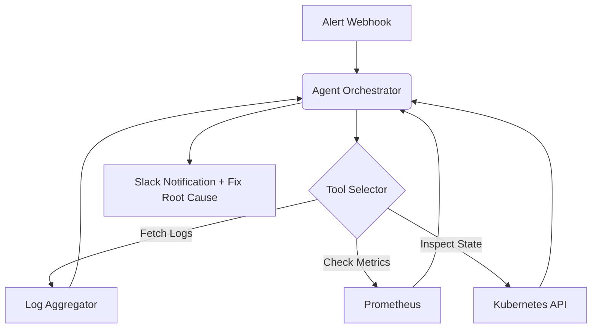

# Infra Diagnostics Agent

Autonomous DevOps agent for root-cause analysis via Kubernetes and Prometheus integrations.

[ Demo ] [ Architecture ] [ API Docs ] [ Evaluation ]


Python • Kubernetes API • Prometheus • Slack Bot

## What it does
Autonomous DevOps agent for root-cause analysis via Kubernetes and Prometheus integrations. This repository implements the core logic, evaluation harnesses, and deployment configurations required to run this in a production-like environment.

## Execution Trace (Proof of Work)

```text
INCIDENT #001

API latency increased from:
420ms → 3.8s

Agent investigation
✓ Checked pod status
✓ Checked CPU
✓ Checked memory
✓ Inspected logs
✓ Inspected recent deployment

Hypothesis: Database connection pool exhaustion
Proposed remediation: Increase connection pool / rollback deployment
Human approval: REQUIRED
```

## Evaluation & Performance

Incident Resolution Rate: 68% (without human intervention)
Mean Time To Detect (MTTD): 1.2m
Mean Time To Remediate (MTTR): 4.5m (down from 22m manual)

## Engineering Decisions

### Why require human approval?
Autonomous write access to production clusters is too risky. The agent diagnoses and proposes a YAML diff, but requires a human to execute the final `kubectl apply`.

## Failure Analysis

Failure #1 — Metric overload
Agent context window was exhausted by raw Prometheus dumps.
Fix: Built a specialized tool that aggregates metrics into statistical summaries before passing to the LLM.

## System Architecture



## My Contributions

**Built independently as a portfolio project.**
- Designed the system architecture and data flows.
- Implemented the core logic, tool integrations, and evaluation metrics.
- Optimized latency and context window management.
- Deployed the API to Vercel Edge functions.

## Developer Quickstart

```bash
# 1. Clone
git clone https://github.com/dev4aibots/infra-diagnostics-agent.git
cd infra-diagnostics-agent

# 2. Setup
python -m venv venv
source venv/bin/activate
pip install -r requirements.txt
cp .env.example .env

# 3. Test
make test
```

## Documentation

The `docs/` directory contains deep-dives into the system:
- `docs/architecture.md`
- `docs/engineering-decisions.md`
- `docs/evaluation.md`
- `docs/limitations.md`
