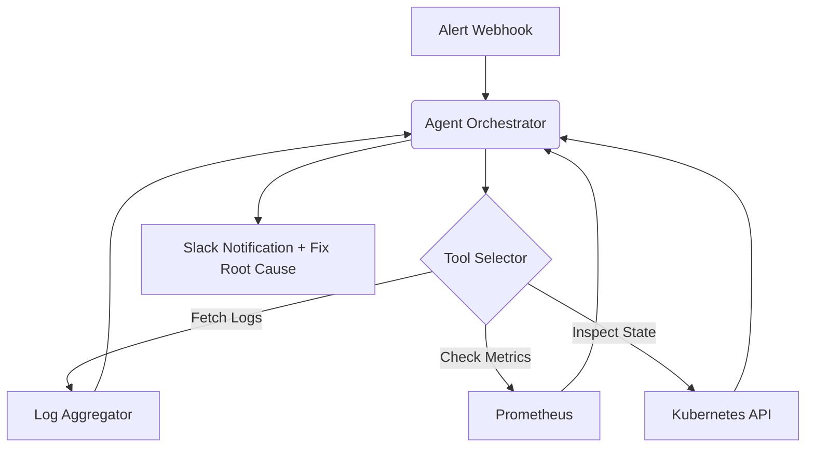

# Infrastructure Diagnostics Agent

An autonomous Python agent that hooks into infrastructure to diagnose and fix operational issues.

## Tech Stack
- **Python**
- **Agents & Tool-Calling** (LangChain paradigms)
- **Infrastructure Integration** (Kubernetes, Docker)
- **APIs/JSON** (Log parsing and metric analysis)


## Architecture



## Live Endpoint (Interactive Demo)
This project is deployed as a serverless backend on Vercel. You can test the API instantly via your terminal.

```bash
# Example Request
curl -X GET https://infra-diagnostics-agent-j2f4f552o-dev4aibots.vercel.app/api/health
```

## Demo
To generate a terminal GIF demonstration using `vhs`, run:
```bash
vhs demo.tape
```
