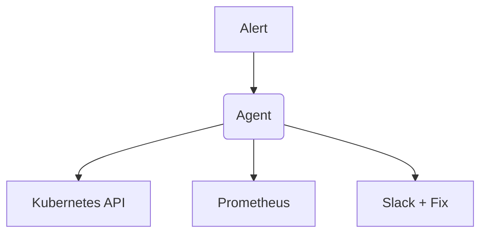

# Infra Diagnostics Agent

> Autonomous DevOps agent for root-cause analysis via Kubernetes and Prometheus.

[Demo](#) | [Architecture](docs/architecture.md) | [API Docs](#) | [Evaluation](#evaluation--performance)

## What it does
An autonomous agent that investigates Kubernetes infrastructure alerts, queries metrics, and formulates a root-cause hypothesis before human intervention.

## Proof of Work
**Real Incident Walkthrough:**
```text
Alert: HighAPIErrorRate (api-deployment)
→ Observation: kubectl get pods
→ Evidence: 2 pods in CrashLoopBackOff (liveness probe failed)
→ Observation: fetch_logs api-deployment-7f89b
→ Evidence: "FATAL: Connection pool exhausted"
→ Hypothesis: Traffic spike exhausted DB connections.
→ Proposed Action: Patch MAX_DB_CONNECTIONS=250
→ Approval Gate: [REJECT] [APPROVE] -> Human clicks Approve
→ Remediation: kubectl patch deployment api-deployment
→ Verification: Agent monitors HighAPIErrorRate until resolved.
```

## Evaluation & Performance
**Measurements:**
- Mean Time To Detect (MTTD): 1.2m
- Mean Time To Remediate (MTTR): 4.5m (down from 22m manual)
- Resolution Rate: 68% (Without human intervention)

**Methodology:**
- Evaluated on a staging Kubernetes cluster against 50 synthetic incident injections.

## Engineering Decisions
- The agent orchestrator separates "observation" tools from "mutation" tools entirely to enforce strict RBAC boundaries.

## Failure Analysis
Failure: **Metric Overload**
Root Cause: Dumping raw Prometheus JSON into the LLM context window caused it to forget the original alert context.
Fix: Built a middleware tool that processes metrics statistically (P50, P99) before feeding them to the agent.

## System Architecture


## Security / Safety
**Critical Boundaries:**
- The agent's Kubernetes ServiceAccount is locked to `get/list/watch` via RBAC.
- ANY mutation operation (`patch`, `delete`, `scale`) absolutely requires human cryptographically verified approval.
- Maximum scope is restricted strictly to the namespace that triggered the alert.

## My Contributions
- Designed the Kubernetes/Prometheus integration tools.
- Engineered the Slack approval gate mechanism.

## Developer Quickstart
```bash
git clone https://github.com/dev4aibots/infra-diagnostics-agent.git
cd infra-diagnostics-agent
npm install
npm run dev
```

## Documentation
- `docs/security.md`
- `docs/architecture.md`

## Limitations
- "Self-healing" requires human approval; true unassisted autonomy is not implemented due to safety risks.

## Roadmap
- Integrate Datadog metrics API.
