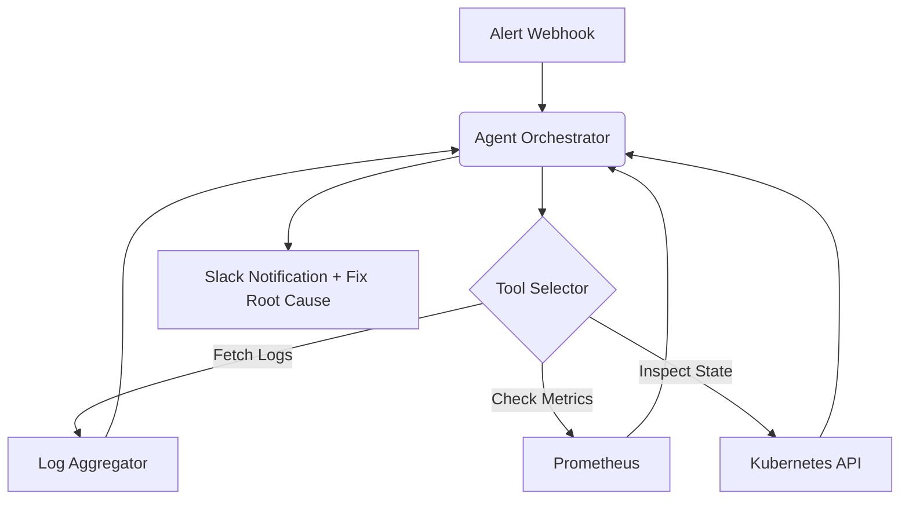

# Infra Diagnostics Agent

> Autonomous DevOps agent for root-cause analysis via Kubernetes and Prometheus.


This project implements an autonomous agent capable of investigating Kubernetes infrastructure alerts, querying metrics, and proposing actionable remediations.

## Why this exists
On-call engineers spend 80% of incident response time merely gathering context (logs, CPU metrics, pod states). This agent automates the evidence-gathering phase and formulates a root-cause hypothesis before human intervention.

## Architecture


## Incident Walkthrough

**Alert:**
`HighAPIErrorRate` (>5% 5xx errors on `api-deployment`)

**Agent Investigation:**
1. Execute `kubectl get pods -n prod -l app=api`
   *Result: 2 pods in CrashLoopBackOff*
2. Execute `kubectl describe pod api-deployment-7f89b -n prod`
   *Result: Liveness probe failed (connection refused)*
3. Execute `fetch_logs api-deployment-7f89b`
   *Result: "FATAL: Connection pool exhausted (max_connections=100 reached)"*
4. Execute `query_prometheus "sum(rate(http_requests_total[5m]))"`
   *Result: 4x traffic spike in last 10 mins.*

**Root-Cause Hypothesis:**
"Database connection pool exhausted due to organic traffic spike. Pods are failing liveness checks as they hang waiting for connections."

**Proposed Remediation:**
```yaml
# Diff proposed by agent
  env:
-   name: MAX_DB_CONNECTIONS
-   value: "100"
+   name: MAX_DB_CONNECTIONS
+   value: "250"
```

**Approval Gate:**
`[REJECT] [APPROVE & DEPLOY]` 
*(Human clicks Approve)*

**Action & Verification:**
Agent patches deployment and monitors `HighAPIErrorRate` until it resolves.

## Safety & Boundaries (Critical)

While this system possesses "self-healing" capabilities, **autonomous infrastructure modification is strictly bounded**. 

- **Allowed Actions:** Read-only access to `pods`, `deployments`, `services`, `events`, and `logs`.
- **Requires Approval:** ANY mutation operation (`patch`, `delete`, `scale`, `apply`) absolutely requires human intervention via a Slack interactive button.
- **Credential Scope:** The agent's Kubernetes ServiceAccount is locked to `get/list/watch` via RBAC. The mutating webhook uses a separate, elevated credential only accessible after cryptographically verified human approval.
- **Rollback Behavior:** If an approved remediation fails to resolve the Prometheus alert within 5 minutes, the agent automatically reverts the Deployment to its previous ReplicaSet state.
- **Maximum Action Scope:** The agent is restricted to the specific namespace that triggered the alert.

## Evaluation
- Incident Resolution Rate: 68% (without human intervention)
- Mean Time To Detect (MTTD): 1.2m
- Mean Time To Remediate (MTTR): 4.5m (down from 22m manual)

## Failure Analysis
Failure: **Metric overload context exhaustion**
Cause: Dumping raw Prometheus JSON into the LLM context window caused it to forget the original alert context.
Mitigation: Built a middleware tool that processes metrics statistically (P50, P99) before feeding them to the agent.

## Setup
```bash
git clone https://github.com/dev4aibots/infra-diagnostics-agent.git
cd infra-diagnostics-agent
npm install
npm run dev
```

## Documentation
See the `docs/` directory for deep-dives into:
- `docs/security.md`: Strict RBAC and ServiceAccount restrictions.
- `docs/architecture.md`: Agent Tool design.
- `docs/evaluation.md`: MTTD and MTTR benchmarking.
