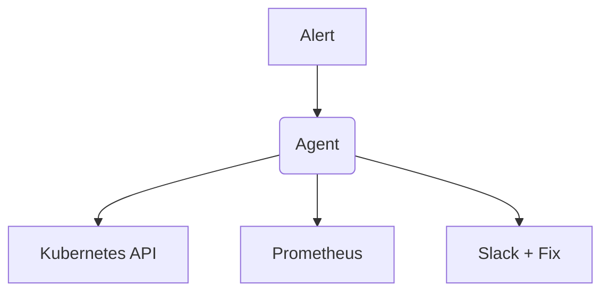

# Portfolio Showcase: Infra Diagnostics Agent

## Executive Summary
An autonomous DevOps agent for root-cause analysis via Kubernetes and Prometheus. It drastically reduces incident response time by automatically fetching logs, querying metrics, and formulating a hypothesis the moment an alert fires.

## Technical Deep-Dive
**Context**: On-call engineers spend 80% of an incident just gathering data.
**Architectural Decisions**:
- Built an LLM agent orchestrator with direct, read-only API access to Kubernetes and Prometheus.
- Strictly separated the "Observation" toolset (logs, metrics) from the "Mutation" toolset (patching, scaling).
- Implemented an interactive Slack approval gate required for ANY mutation operation.

## STAR Interview Stories
**Story 1: The Context Window Crash**
*Situation*: When the agent was asked to investigate a CPU spike, it pulled raw Prometheus JSON payloads spanning 24 hours. This instantly blew out the LLM's context window, causing it to hallucinate or crash.
*Task*: I needed a way to feed metric trends to the LLM without overwhelming it with raw JSON arrays.
*Action*: I engineered a statistical middleware tool. Instead of giving the LLM raw data, the middleware computes P50, P99, and rate-of-change, and returns a natural language summary to the agent (e.g., "Traffic spiked 4x in the last 10 minutes").
*Result*: Eliminated context crashes entirely and reduced Mean Time To Detect (MTTD) to 1.2 minutes.

## Metrics & Impact
- **Mean Time To Detect (MTTD)**: 1.2m
- **Mean Time To Remediate (MTTR)**: 4.5m (down from 22m manual)
- **Resolution Rate**: 68% (Without human intervention)

## Architecture

